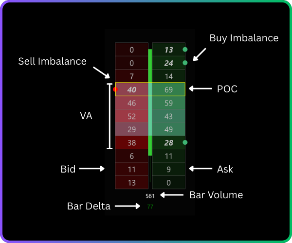
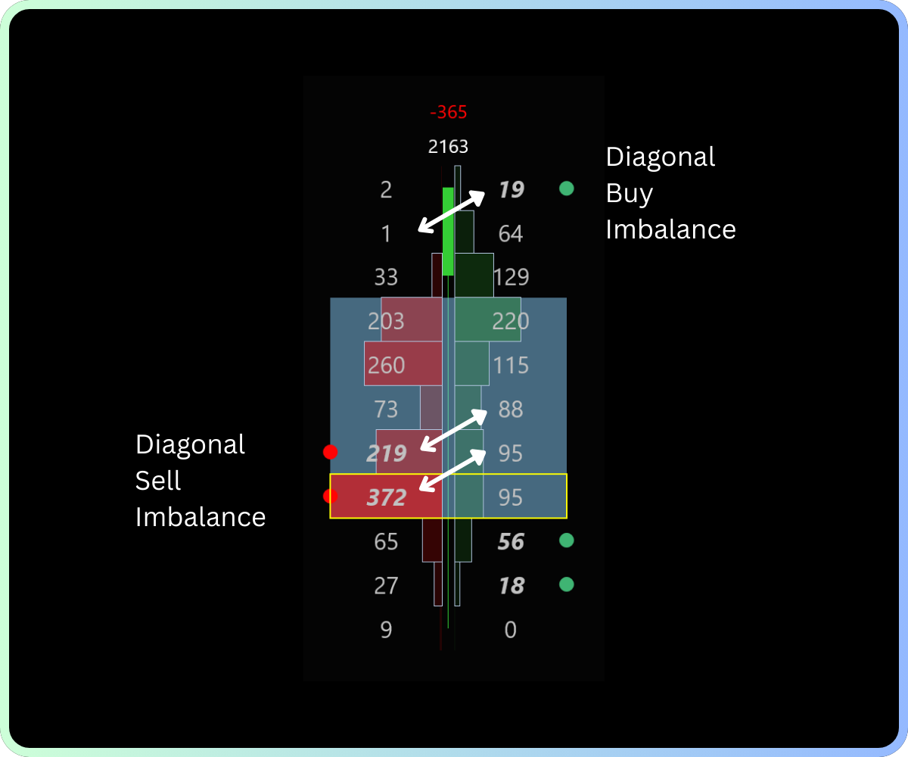
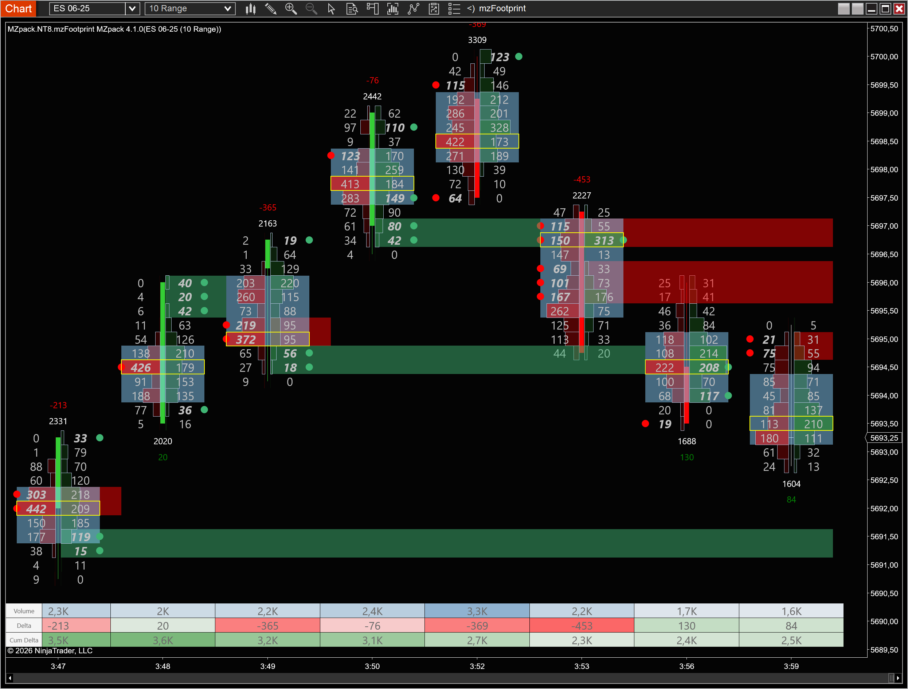

# Order Flow

Order flow is the real-time stream of executed trades and pending orders flowing through an exchange. While a standard candlestick chart shows only open, high, low, and close, order flow analysis looks *inside* each bar to reveal the actual buying and selling activity at every price level. MZpack reconstructs this activity from tick-level data, giving you a detailed view of market microstructure.

## How Trades Are Matched

Every trade on an exchange requires two participants — a buyer and a seller — matched by the exchange's matching engine:

- **Market orders** execute immediately at the best available price. They are the aggressive side of the trade.
- **Limit orders** rest in the order book at a specified price, waiting to be filled. They are the passive side.

When a trader sends a **buy market order**, it lifts the best resting sell limit (the ask). When a trader sends a **sell market order**, it hits the best resting buy limit (the bid). This distinction — whether a trade was executed at the bid or at the ask — is the foundation of order flow analysis.

- **Trade at ask** = a buy market order hit a sell limit order → buying aggression
- **Trade at bid** = a sell market order hit a buy limit order → selling aggression

By tracking which side initiates each trade, you can measure whether buyers or sellers are more aggressive at any given moment.

## Trade Classification

To split volume into buying and selling, MZpack must classify each trade. The **calculation mode** determines how this classification works. The table below summarizes the three available modes — for full details, see [Indicators Overview — Calculation Modes](../indicators/overview.md#order-flow-calculation-modes).

| Mode | Method | When to Use |
|---|---|---|
| **BidAsk** | Trade hit the bid → sell; trade lifted the ask → buy | Futures with Tick Replay enabled (most accurate) |
| **UpDownTick** | Uptick or same-price after uptick → buy; downtick or same-price after downtick → sell | Forex, crypto, stocks, or any data without bid/ask attribution |
| **Hybrid** | UpDownTick for historical bars, BidAsk for live bars | Markets where historical bid/ask data is unavailable (e.g., NSE) |

**BidAsk** is the most accurate mode because it uses the actual side of execution reported by the exchange. **UpDownTick** is an approximation based on price direction. **Hybrid** combines both — accurate classification in real time, approximate for history.

### Spread Trades

Trades that occur inside the bid-ask spread (between the best bid and best ask) cannot be classified as purely buy or sell. MZpack offers three handling options:

| Option | Behavior |
|---|---|
| **Ignore** | Discard spread trades entirely (default) |
| **Split** | Allocate 50% to buy side, 50% to sell side |
| **LastKnownSide** | Assign the trade to the same side as the previous trade |

## Data Levels

MZpack indicators work with two types of market data:

**Level 1 (tick data)** provides the trade-by-trade record: last price, volume, and the bid/ask prices at the time of the trade. This is the data source for most MZpack indicators — [mzFootprint](../indicators/mzFootprint.md), [mzBigTrade](../indicators/mzBigTrade.md), [mzVolumeDelta](../indicators/mzVolumeDelta.md), and [mzDeltaDivergence](../indicators/mzDeltaDivergence.md) all process Level 1 data.

**Level 2 (DOM data)** provides the full order book — all resting limit orders at every price level with their sizes. [mzMarketDepth](../indicators/mzMarketDepth.md) uses Level 2 data to visualize order book dynamics, liquidity migration, and iceberg order detection.

**CME MDP 3.0** is the CME Group's market data protocol, which provides high-resolution Level 1 and Level 2 data used by MZpack.

:::info Tick Replay
MZpack processes historical data with NinjaTrader's **Tick Replay** option enabled. Without Tick Replay, historical bars lack the tick-by-tick detail needed for order flow reconstruction. Some features (iceberg detection, DOM pressure) require live data because NinjaTrader does not provide historical Level 2 data.
:::

## Footprint (Cluster) Charts

The footprint chart is the primary order flow visualization. It breaks each price bar into individual price levels and shows the volume transacted at each level, split by buying and selling activity.

Each cell in a footprint is called a **cluster** — it represents a single price level within a bar. A cluster can display:

- **Bid x Ask volume** — contracts traded on the bid vs. ask side
- **Total volume** — all contracts at that price level
- **Delta** — the difference between ask and bid volume
- **Number of trades** — how many individual trades occurred

The classical footprint style shows two numbers per cluster: bid volume on the left, ask volume on the right. Other styles (Volume, Delta, DeltaPercentage, TradesNumber) show a single value. MZpack supports 8 footprint styles with two independent columns — see [mzFootprint — Footprint Styles](../indicators/mzFootprint.md#footprint-styles) for the complete list.

## Delta

Delta is the core metric of order flow analysis. It measures the net difference between buying and selling volume:

**Cluster delta** = Ask volume − Bid volume (at a single price level)

**Bar delta** = the sum of all cluster deltas across the bar

- **Positive delta** → more volume traded at the ask → buying pressure
- **Negative delta** → more volume traded at the bid → selling pressure

### Delta Percentage

Delta percentage normalizes delta by total volume, making it comparable across different instruments and timeframes:

**Delta %** = (Delta / Volume) × 100

A cluster with 100 ask volume and 20 bid volume has delta = 80 and delta % = 67% — strong buying dominance at that level.

### Cumulative Delta

Cumulative delta is the running total of bar deltas across a session. It reveals whether buyers or sellers have been dominant over a longer period:

- **Rising cumulative delta** → sustained buying pressure
- **Falling cumulative delta** → sustained selling pressure
- **Divergence** between price and cumulative delta can signal potential reversals — see [mzDeltaDivergence](../indicators/mzDeltaDivergence.md)

For deeper analysis of delta concepts, see [Delta Analysis](delta-analysis.md).

## Imbalance

Imbalance detects aggressive one-sided activity by comparing volumes **diagonally** across price levels. This diagonal comparison reflects how market orders consume liquidity at the current level relative to resting orders at the adjacent level.

The calculation compares ask volume at price N against bid volume at price N−1 (one tick below):

- **Buy imbalance** at price N: Ask volume at N is significantly greater than Bid volume at N−1 → buyers are aggressively lifting offers, overwhelming the passive sellers below
- **Sell imbalance** at price N: Bid volume at N is significantly greater than Ask volume at N+1 → sellers are aggressively hitting bids, overwhelming the passive buyers above

The threshold is a percentage ratio. For example, with a 300% threshold: if Ask volume at 2384.50 is 71 lots and Bid volume at 2384.25 is 19 lots, the ratio is (71/19 − 1) × 100 = 274% — below the threshold, so no imbalance is flagged. If the ratio exceeds 300%, a buy imbalance is highlighted.

Consecutive imbalances stacked at adjacent price levels indicate strong directional conviction.

## Absorption

Absorption is the counterpart to imbalance. Where imbalance shows *aggressive* activity, absorption shows *passive* defense — limit orders quietly absorbing market orders without letting price advance.

Absorption is an imbalance with **price rejection**: the aggressive side pushes volume at a level, but price reverses away from it. The **depth** parameter (in ticks) defines how far price must bounce from the absorption level to confirm the pattern.

- **Sell absorption** — aggressive sellers are absorbed by resting buy limit orders, price bounces up → potential support
- **Buy absorption** — aggressive buyers are absorbed by resting sell limit orders, price bounces down → potential resistance

Absorption reveals where institutional-size limit orders are positioned, often invisible on a standard chart.

## Support and Resistance Zones

MZpack builds support and resistance zones from clusters of imbalance and absorption levels:

- **Imbalance-based zones:** Stacked ask-side imbalances form a support zone (buyers were aggressive). Stacked bid-side imbalances form a resistance zone (sellers were aggressive).
- **Absorption-based zones:** The logic is reversed — bid-side absorption (buyers absorbing sellers) creates support, while ask-side absorption (sellers absorbing buyers) creates resistance.

Zone strength depends on:
- **Volume** — total volume across all levels in the zone
- **Consecutive levels** — more adjacent levels = stronger zone

A zone is terminated when price crosses through it and closes beyond the zone (above a resistance zone or below a support zone), or at the end of a session if the **Break on session** option is enabled.

See [mzFootprint — Imbalance S/R Zones](../indicators/mzFootprint.md#imbalance-sr-zones) for configuration details.

## Key Order Flow Metrics

Beyond delta and imbalance, MZpack computes several derived metrics that provide additional insight:

| Metric | What It Measures |
|---|---|
| **COT (Commitment of Traders)** | Cumulative delta starting from a price extreme (new high or low). Shows whether participants are committing to or rejecting the new price level. Negative COT at a new high suggests sellers are rejecting the move; positive COT confirms buyer commitment. |
| **Delta Rate** | The speed of delta change within a time or tick interval. High delta rate indicates rapid, concentrated order flow — triggered stops, breakouts, or reversals. |
| **Ratio Numbers** | Bid/ask volume ratio at bar extremes. A high ratio (above the upper bound) means the extreme price is being *rejected*. A low ratio (below the lower bound) means the extreme is being *defended*. Neutral values indicate trade facilitation. |
| **Unfinished Auction** | A bar high or low where no trades occurred on the opposing side — the auction didn't complete, suggesting price may revisit that level. |

## Where to Go Next

- **[mzFootprint](../indicators/mzFootprint.md)** — configure footprint charts, imbalance, absorption, and S/R zones
- **[mzBigTrade](../indicators/mzBigTrade.md)** — detect and filter large trades from the tape
- **[mzVolumeDelta](../indicators/mzVolumeDelta.md)** — delta histograms, candles, and cumulative delta
- **[mzDeltaDivergence](../indicators/mzDeltaDivergence.md)** — automated delta-price divergence signals
- **[Volume Profiling](volume-profiling.md)** — horizontal volume distribution concepts
- **[Delta Analysis](delta-analysis.md)** — deeper dive into delta interpretation and divergences
