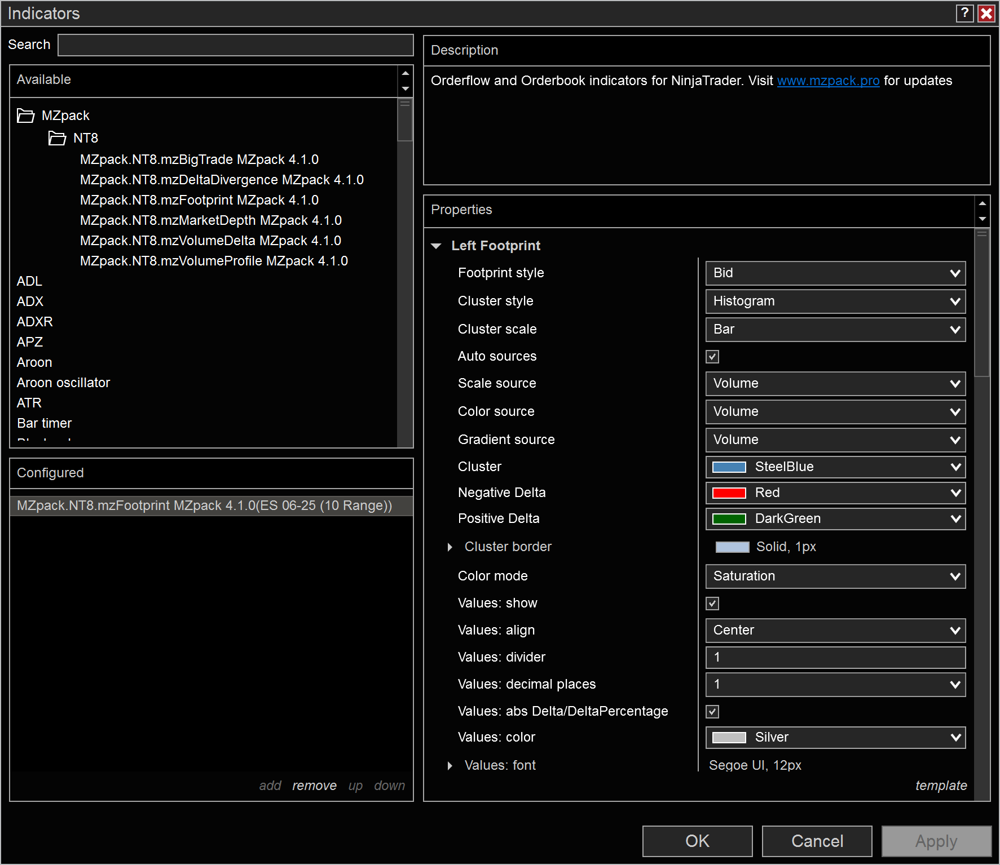
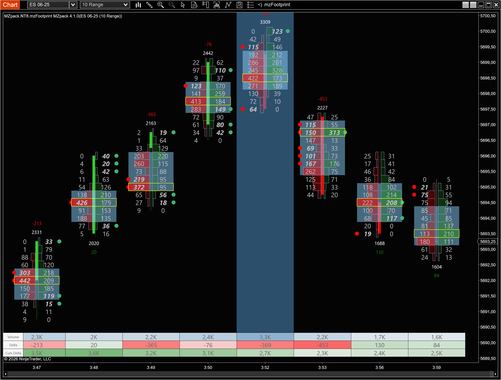
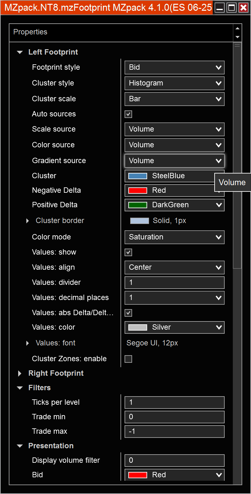

# Your First Indicator

This guide walks you through adding and configuring an MZpack indicator on a NinjaTrader 8 chart. We'll use **mzFootprint** as the example, but the steps are the same for any MZpack indicator.

## Prerequisites

- NinjaTrader 8 installed and running (see [System Requirements](system-requirements.md))
- MZpack installed (see [Installation](installation.md))
- A valid license or trial activated (see [Licensing](licensing.md))
- A chart open with tick-level data

## Step 1: Open a Chart

1. In NinjaTrader, open a chart for any instrument (e.g., ES, NQ, CL)
2. Use a time-based or tick-based data series — for example, **5-minute** or **1000 tick** bars
3. Ensure you are connected to a data feed that provides tick data

:::tip
For your first experience, use a **Sim101** account with a liquid futures instrument like ES (E-mini S&P 500). This gives you real-time tick data without a live trading account.
:::

## Step 2: Add the Indicator

1. Right-click on the chart
2. Select **Indicators** from the context menu
3. In the indicator list, type `mzFootprint` in the search box
4. Select **mzFootprint** and click **Add**
5. Click **OK** to apply

The footprint chart will begin rendering on your chart once enough data is loaded.

## Step 3: Understand the Display

The mzFootprint indicator overlays order flow data directly on your price bars. Each bar shows:

- **Bid/Ask volumes** — the number of contracts traded at the bid and ask at each price level
- **Delta** — the difference between ask and bid volume (buying vs. selling pressure)
- **Imbalances** — highlighted cells where the bid/ask ratio exceeds a threshold, indicating aggressive buying or selling
- **POC** — the price level with the highest volume within the bar (Point of Control)

## Step 4: Configure Settings

The quickest way to adjust settings is through the **on-the-fly settings** available on the indicator toolbar at the top of the chart. Click the indicator name on the toolbar to access commonly used settings without opening any dialogs. You can also toggle indicator visibility using the **eye** button next to the indicator name.

:::tip
For the full list of settings, right-click the chart, select **Indicators**, choose **mzFootprint** from the active indicators list, and adjust in the properties panel.
:::

Key settings categories:

| Category | What it controls |
|---|---|
| **Left Footprint** | Bid/Ask column layout and colors for the left side |
| **Right Footprint** | Bid/Ask column layout and colors for the right side |
| **Filters** | Volume and price filters for display |
| **Presentation** | Visual style, fonts, cell sizing |
| **Bar Statistics** | Summary statistics shown per bar (delta, volume, etc.) |
| **Imbalance** | Imbalance detection threshold and highlighting |
| **Absorption** | Absorption pattern detection |
| **Bar Volume Profile** | Per-bar volume distribution display |

Start with the defaults and adjust as you become familiar with order flow analysis.

## Step 5: Try Other Indicators

Once you're comfortable with mzFootprint, try adding other MZpack indicators to your chart:

| Indicator | Best for |
|---|---|
| [mzVolumeProfile](../indicators/mzVolumeProfile.md) | Identifying key support/resistance levels via volume distribution |
| [mzVolumeDelta](../indicators/mzVolumeDelta.md) | Tracking cumulative buying/selling pressure |
| [mzBigTrade](../indicators/mzBigTrade.md) | Spotting large institutional trades in real-time |
| [mzMarketDepth](../indicators/mzMarketDepth.md) | Visualizing the order book (requires Level 2 data) |
| [mzDeltaDivergence](../indicators/mzDeltaDivergence.md) | Detecting divergences between price and delta |

## Next Steps

- Learn the concepts behind order flow analysis in the [Concepts](../concepts/order-flow.md) section
- Explore each indicator's full settings in the [Indicators](../indicators/overview.md) section
- Build automated trading with MZpack [Strategies](../strategies/overview.md)
- If you're a developer, see the [API Reference](/api/getting-started/overview) to build custom indicators and strategies
